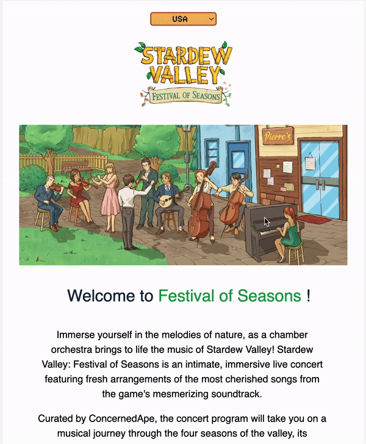

# Responsive Email Stardew

This responsive email was created as a hobby project to celebrate the Stardew Valley Festival of Seasons tour. It utilizes dynamic content based on user-selected country and incorporates responsive design for optimal viewing across various devices.

[👆VEW EMAIL👆](https://hswinata.github.io/email_stardew/) 

## Features
   

1. **Responsive design**: Ensures optimal user experience on various devices and orientations.
2. **Localized Content**: Dynamically pulls content (text, dates) from JSON files based on the user's chosen country. Supported languages include:
  * English
  * German
  * French
  * Italian
  * Japanese
  * Korean
  * Thai

3. **Country Selection**: Users can choose their country from a dropdown menu, triggering automatic content and date adjustments.
4. **Mobile Optimization**: Tailored layout and styles ensure a smooth reading experience on mobile devices.

## Technologies
1. **HTML**: A well-structured HTML layout ensures proper rendering across email clients.
2. **CSS**: Responsive design principles are implemented using media queries to adjust styles based on screen size and orientation.
3. **JavaScript** 
  * Fetches localized content (text and dates) from JSON files based on the selected country.
  * Populates the email content dynamically using the fetched data.
  * Handles formatting of dates according to different locales using the formatDate function.
  * Manages the country selection dropdown and triggers content updates upon user selection.
  * Font sizes and element spacing adapt dynamically for improved readability across devices.
  * Images adjust their width and height for a visually appealing presentation.
  * Mobile-specific elements can be shown or hidden based on the device.
